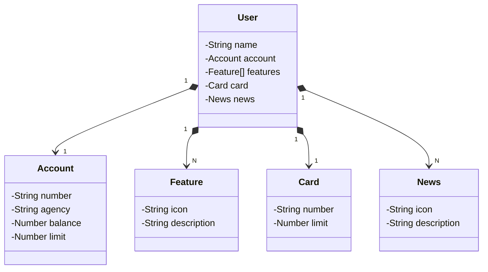

# Projeto Fullstack com Java 17, Spring Boot 3 e Angular - Dio Decola Tech 2025

Desafio de projeto proposto no módulo de `Desenvolvimento de APIs REST com Spring Framework` do Bootcamp Dio Decola Tech 2025.

## Tabela de conteúdos

- [Overview](#overview)
  - [O projeto](#o-projeto)
  - [Diagrama de Classes](#diagrama-de-classes)
  - [Links](#links)
- [Processo](#processo)
  - [Tech Stack](#tech-stack)
- [Autor](#autor)

## Overview

### O projeto

API Rest criada para fornecer endpoints para o gerenciamento de usuários em um banco de dados (criar, listar, editar/atualizar e excluir).

## Diagrama de classes

### Links

- Repositório do front-end: [Link](https://github.com/danielmrz-dev/projeto-java-spring-boot-front)
- Link do deploy da aplicação: [Link](https://projeto-java-spring-boot-front.vercel.app)

## Processo

### Tech Stack

- Spring Initializr
- Mermaid
- Java 17
- Spring Boot 3
- Banco de Dados Postgres
- Railway

## Autor

- LinkedIn - [@danielmrz-dev](https://www.linkedin.com/in/danielmrz-dev/)
- Portfolio - [Link](https://danielmrz-portfolio.vercel.app/)

